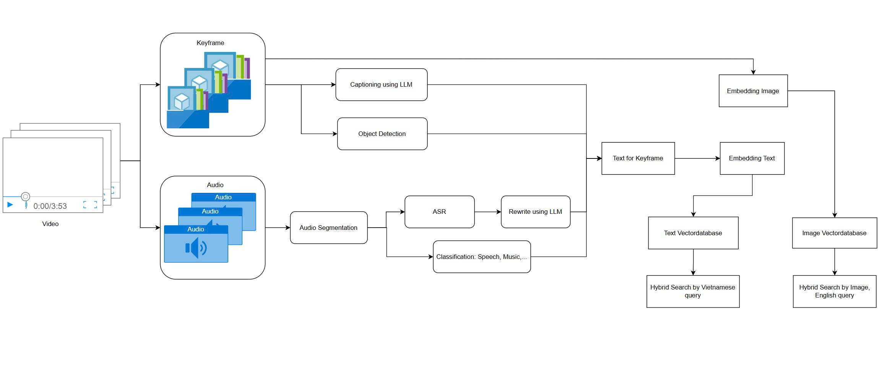

# <p align="center">**📺 Multimodal Video Retrieval System**</p>

## <p align="center">**Semantic video search with text, speech, and image queries**</p>

<p align="center">
  <a href="https://ai-challenge-frontend.vercel.app/"></a>
  &nbsp;
  
  &nbsp;
  
</p>

---

## 🔍 Overview

This project implements an **end-to-end multimodal video retrieval system** that enables **semantic search** across large-scale video collections.  
Users can query videos using **text, speech (Vietnamese), or image inputs**, and the system retrieves the most relevant video segments with **captions, transcripts, timestamps, and thumbnails**.

The system integrates state-of-the-art AI models for captioning, object detection, speech recognition, and embedding generation, combined with a vector database (Weaviate) for efficient large-scale retrieval. A modern React front-end provides an intuitive interface for query submission and result visualization.

---

## ✨ Demo

- 🔗 **Live Demo**: [ai-challenge-frontend.vercel.app](https://ai-challenge-frontend.vercel.app/)  
- 🎬 **Frontend Repository**: [AI_Challenge_Frontend](https://github.com/dngan0365/AI_Challenge_Frontend)  

---

## 🔑 Key Features

- 🔍 **Multimodal retrieval** — query with **text, speech, or image**  
- 🧠 **Semantic enrichment** — captions + transcripts for deeper context  
- 🖼 **Frame-level search results** with thumbnails & timestamps  
- ⚡ **Hybrid retrieval** — fuse text & image embeddings  
- 🗂 **Metadata filtering** — filter by objects, time, video ID  
- 📊 **Score fusion & reranking** for higher retrieval precision  
- 📝 **Session logging & history** for reproducibility  
- ☁️ **Cloud-ready**: GCS (storage), Weaviate (vector DB), Vercel (frontend)  

---

## **🏗 System Architecture**

The system is composed of two major components:

### **🔹 Backend (FastAPI)**
The backend orchestrates data ingestion, offline indexing, query processing, and retrieval. It leverages the following AI models and technologies:

* **Video Processing**
  * *Keyframe Extraction* – splits videos into representative frames.
  * *Scene Captioning* – [Vintern-1B-v3.5](https://huggingface.co/5CD-AI/Vintern-1B-v3_5) generates natural language descriptions of keyframes.
  * *Object Detection* – detects and labels objects within frames for metadata filtering.
  * *Image Embedding* – [CLIP](https://openai.com/research/clip) and [SigLIP](https://huggingface.co) encode frames into dense vectors.
    
* **Audio Processing**
  * *Segmentation* – WebRTC VAD detects speech segments in audio tracks.
  * *ASR* – linhtq/viet-asr transcribes Vietnamese speech.
  * *Transcript Post-processing* – Gemini refines transcripts (punctuation, normalization).
  * *Text Embedding* – [Gemma-300m](https://huggingface.co/google/embeddinggemma-300m) encodes transcripts into embeddings.

* **Vector Search**
  * Weaviate maintains two collections:
    * **Image Vector DB** – stores frame embeddings (CLIP/SigLIP).
    * **Text Vector DB** – stores caption and transcript embeddings (Gemma).
  * Supports **hybrid retrieval** (text \+ image).
  * Metadata filtering and score fusion improve result ranking.

* **Storage**
  * Google Cloud Storage (GCS) stores raw videos, extracted audio, and keyframes.
  * Relational database logs sessions, queries, and retrieval results.
---

### **🔹 Frontend (React)**
The frontend provides an interactive interface for users to:
* Submit queries in **text, speech, or image** form.
* Browse results via a **Result Panel** showing thumbnails, captions, transcripts, and timestamps.
* Navigate results **temporally** (by video timeline) and **contextually** (neighboring frames/segments).
* Manage query sessions and view search history.

The interface is built with:
* **React \+ Vite** – fast modern web framework.
* **TailwindCSS \+ shadcn/ui** – clean, responsive UI components.
* **REST API integration** with FastAPI backend.

---

## 📦 System Pipeline (End-to-End)



### 🧱 Offline Indexing
Batch processing to build the vector indices.

- **Video Registration & Metadata:** Register `video_id` and URI; persist raw media in **Google Cloud Storage (GCS)**.
- **Keyframe Extraction:** Sample representative frames from each video.  
  **Output:** list of keyframes with timestamps.
- **Audio Extraction:** Extract the audio track from the video.  
  **Output:** raw audio file.
- **Scene Captioning (Vintern-1B-v3.5):** Generate semantic captions for each keyframe.  
  *Optional:* embed captions with **Gemma-300m** and index in the Text DB.
- **Object Detection (BTC model):** Detect and label objects in keyframes for downstream filtering.  
  **Output:** object labels stored in the Metadata DB.
- **Image Embeddings (CLIP / SigLIP):** Encode each keyframe into a visual embedding.  
  **Output:** vectors written to **Weaviate — Image Vector DB**.
- **Segmentation (WebRTC VAD):** Split audio into speech-active segments.  
  **Output:** speech segments.
- **ASR (linhtq/viet-asr):** Transcribe each speech segment into Vietnamese text.  
  **Output:** raw transcripts.
- **Transcript Refinement (Gemini):** Normalize punctuation, remove fillers, and tidy grammar without changing meaning.  
  **Output:** cleaned transcripts.
- **Text Embeddings (embedding-gemma-300m):** Encode cleaned transcripts (and optional captions) into text embeddings.  
  **Output:** vectors written to **Weaviate — Text Vector DB**.
---
### 🗃️ Storage & Indices
- **GCS:** raw videos, audio files, keyframes, and artifacts.  
- **Weaviate — Image Vector DB:** CLIP/SigLIP embeddings for keyframes.  
- **Weaviate — Text Vector DB:** Gemma embeddings for captions (Vintern → Gemma) and transcripts (ASR + Gemini → Gemma).  
- **Metadata / Relational DB:** sessions, queries, results, keyframe info, object labels, timestamps, model versions.

---

### ⚡ Online Query Processing & Retrieval
- **Frontend (React)**  
  Submit queries in **text / image / speech** via REST API; display **Top-N** results (thumbnail, caption/transcript snippet, timestamp, score).  
  Supports temporal (timeline) and contextual (neighbor frames) navigation.
- **Backend (FastAPI)**  
  `POST /query-text` (text) • `POST /query-img` (image/hybrid) • `GET /history` (saved results) • `POST /session` (session management)
- **Query Normalization**  
  - Text query → **Gemma-300m** → text vector  
  - Speech query → **ASR → Gemini → Gemma-300m** → text vector  
  - Image query → **CLIP/SigLIP** → image vector
- **Hybrid Vector Search:** Search Text Vector DB and Image Vector DB in parallel; merge candidate sets (union or intersection).
- **Metadata Filters:** Filter by `video_id`, time range, and object labels.
- **Score Fusion & Reranking:** Combine cross-modal scores and rerank to produce the final list.
- **Top-N Results:** Return frame, timestamp, preview, caption/transcript snippet, and score; log session/query/results to the Metadata DB.
---

## **🛠 Technologies**

* **Backend**: FastAPI, Weaviate, PostgreSQL, GCS
* **Frontend**: React, Vite, TailwindCSS, shadcn/ui
* **AI Models**:
  * Vintern-1B-v3.5 (captioning)
  * CLIP & SigLIP (image embeddings)
  * Object Detection (custom/BTC model)
  * Viet-ASR (speech recognition)
  * Gemini (LLM transcript refinement)
  * Gemma-300m (text embeddings)
---

## 🤖 AI Models & Techniques

| Component              | Model / Tool         | Role                                |
|------------------------|----------------------|-------------------------------------|
| **Captioning**         | Vintern-1B-v3.5      | Generate keyframe captions           |
| **Object Detection**   | Faster R-CNN         | Detect objects for metadata filter   |
| **Image Embeddings**   | CLIP / SigLIP        | Encode keyframes into vectors        |
| **Segmentation**       | WebRTC VAD           | Detect voice activity in audio       |
| **ASR**                | linhtq/viet-asr      | Transcribe Vietnamese speech         |
| **Transcript Cleaning**| Gemini               | Normalize transcripts & punctuation  |
| **Text Embeddings**    | Gemma-300m           | Encode captions & transcripts        |
| **Vector DB**          | Weaviate             | ANN search, hybrid retrieval         |
| **Storage**            | GCS                  | Store raw media & extracted data     |

---

## 📂 Dataset

- **Source**: AIC-provided dataset (videos, Vietnamese audio, annotations)  
- **Processing**:
  - Keyframes: extracted by interval/scene change  
  - Audio: segmented by VAD before ASR  
  - Captions & transcripts: embedded with Gemma  
  - Object labels stored for filtering  
- **Splits**: Separate indexing and query/evaluation sets  
- **Storage**: Google Cloud Storage (frames, audio, metadata)  
- **License**: Academic / research use only  

---


## 🚀 Getting Started

### Prerequisites
Before running the project, make sure you have:
- Python 3.11+
- Node.js 18+
- (Optional) Docker for containerized deployment
- Google Cloud Storage (GCS) account and bucket
- Weaviate (self-hosted or managed)

### 📂 Project Structure

```text
your_project/
│
├── app/
│   ├── main.py                # FastAPI entry point
│   ├── core/                  # Configs and settings
│   ├── db/                    # Database connection and session management
│   ├── models/                # Database models (Video, User, Query, …)
│   ├── schemas/               # Pydantic schemas for request/response
│   ├── crud/                  # CRUD operations
│   ├── ai/                    # AI logic: model loading, retrieval pipeline
│   ├── cloud/                 # Google Cloud integration (storage, pubsub, …)
│   ├── services/              # Business logic & orchestration
│   ├── api/v1/                # API endpoints (videos, search, …)
│   └── utils/                 # Utility functions
│
├── frontend/                  # React frontend (UI for upload/query/results)
├── tests/                     # Unit & integration tests
├── migrations/                # Alembic DB migrations (if used)
├── .env                       # Environment variables
├── requirements.txt           # Python dependencies
├── package.json               # Frontend dependencies
└── README.md                  # Documentation
```
---
### ⚙️ Backend Setup (FastAPI)

#### 1. Create and activate a virtual environment:
```bash
python -m venv venv
source venv/bin/activate   # macOS/Linux
venv\Scripts\activate      # Windows
```

#### 2. Install dependencies:
```bash
pip install -r requirements.txt
```

#### 3. Run the backend:
```bash
uvicorn app.main:app --host 0.0.0.0 --port 8000
```
---
### 💻 Frontend Setup (React)

#### 1. Navigate to the frontend directory:
```bash
cd frontend
```

#### 2. Install dependencies:
```bash
npm install
```

#### 3. Run the frontend:
```bash
npm run dev
```
 - Open your browser at the URL shown in the console (default: http://localhost:3000).
---
### 🐳 (Optional) Run with Docker

#### 1. Build the backend Docker image:
```bash
docker build -t video-retrieval-backend .
```

#### 2. Run the container:
```bash
docker run -p 8000:8000 video-retrieval-backend
```
---
### ☁️ Deployment to Google Cloud Run

#### 1. Build and push the image:
```bash
gcloud builds submit --tag gcr.io/PROJECT_ID/fastapi-backend
```

#### 2. Deploy:
```bash
gcloud run deploy fastapi-backend \
  --image gcr.io/PROJECT_ID/fastapi-backend \
  --region asia-southeast1 \
  --platform managed \
  --allow-unauthenticated
```

---
✨ This system makes video search powerful, intuitive, and multimodal — enabling retrieval across text, audio, and images.
